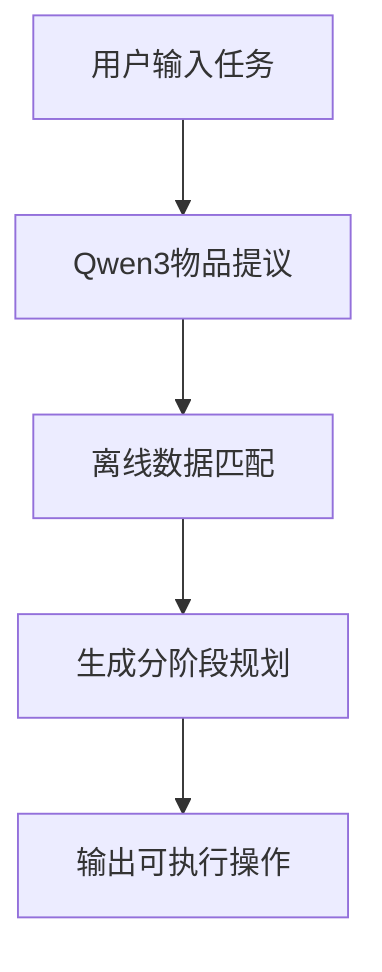

# NLMap + Qwen3 机器人导航与物品提议系统

**作者**: 肖宇杰  
**学校**: 南方科技大学  
**邮箱**: 12433332@mail.sustech.edu.cn  
**日期**: 2025年6月5日  

本项目实现了基于自然语言的机器人导航系统，结合了NLMap的空间理解能力和Qwen3大语言模型的物品提议功能，为机器人提供智能的任务规划和执行能力。

## 🚀 项目特性

- **自然语言理解**: 支持中英文任务描述输入
- **智能物品提议**: 基于Qwen3-4B模型进行物品推理
- **空间语义映射**: 利用NLMap进行环境理解和物品定位
- **分阶段任务规划**: 自动生成结构化的执行计划
- **离线数据支持**: 支持从离线数据集提取物品清单
- **交互式界面**: 提供友好的命令行交互体验

## 📋 系统要求

### 环境信息
- Python: 3.10+
- PyTorch: 2.5.1+cu121 (CUDA支持)
- Transformers: 4.52.4
- 设备: CUDA (GPU加速推荐)

### 依赖安装

```bash
# 创建conda环境
conda create -n nlmap_qwen3_v2 python=3.10
conda activate nlmap_qwen3_v2

# 安装依赖
pip install -r requirements.txt
pip install tensorflow  # 用于NLMap
```

## 📁 项目结构

```
├── nlmap_spot-main/                 # 主要代码目录
│   ├── offline_nlmap_qwen3_demo.py  # 离线演示脚本
│   ├── saycan_qwen3.py              # Qwen3物品提议器
│   ├── nlmap.py                     # NLMap核心模块
│   ├── configs/                     # 配置文件
│   │   └── unline_data_config.ini   # 离线数据配置
│   ├── unline_data/                 # 离线数据集
│   │   └── cit121_115/              # 示例数据
│   └── requirements.txt             # 依赖列表
├── Qwen3-main/                      # Qwen3模型文件
│   └── Qwen3-models/                # 模型权重
└── README.md                        # 项目说明
```

## 🎯 快速开始

### 1. 模型准备

确保Qwen3-4B模型已下载到正确位置：
```
Qwen3-main/Qwen3-models/
├── config.json
├── model-*.safetensors
├── tokenizer.json
└── ...
```

### 2. 运行演示

```bash
cd nlmap_spot-main
python offline_nlmap_qwen3_demo.py
```

### 3. 交互使用

启动后，您可以：
- 输入任务描述（如："把笔记本放到桌子上的杯子旁边"）
- 输入 `list` 查看可用物品清单
- 输入 `quit` 退出系统

## 💡 使用示例

### 任务示例

```
🤖 请输入任务描述: 制作一杯咖啡

🔍 处理任务: 制作一杯咖啡
----------------------------------------

1. Qwen3 物品提议:
   提议的物品: coffee machine, cup, coffee beans, water

2. 在离线数据中查找匹配:
   ✓ 找到 4 个匹配物品:
   • coffee machine: 位置 (-1.21, -1.35, 0.36)
   • cup: 位置 (0.29, 1.72, 1.07)
   • coffee beans: 位置 (1.15, 0.83, 0.92)
   • water: 位置 (-0.45, 2.11, 0.78)

3. 分阶段规划:
   **阶段一：获取所需物品**
   1. 前往厨房台面，拿取咖啡机
   2. 前往橱柜，取出咖啡杯
   3. 前往储物柜，获取咖啡豆
   4. 前往水槽，准备清水

   **阶段二：分步执行规划**
   1. 将咖啡机放置在合适的工作台面上
   2. 检查咖啡机电源连接
   3. 在咖啡机中加入适量清水
   4. 将咖啡豆放入咖啡机的豆仓中
   5. 将咖啡杯放在咖啡机出水口下方
   6. 启动咖啡机开始制作咖啡

4. 可执行的操作:
   • 导航到 coffee machine: 目标位置 (-1.21, -1.35, 0.36)
   • 抓取 coffee machine: 在图像 color_20.jpg 中检测到
   • 导航到 cup: 目标位置 (0.29, 1.72, 1.07)
   • 抓取 cup: 在图像 color_1.jpg 中检测到
```

## 🔧 配置说明

### 数据配置 (configs/unline_data_config.ini)

```ini
data = cit121_115

[paths]
data_dir_root = ./unline_data
pose_file = poses.txt
image_dir = color
```

### 模型路径配置

在 `saycan_qwen3.py` 中修改模型路径：
```python
model_path = "path/to/your/Qwen3-models"
```

## 📊 技术架构

### 核心组件

1. **NLMap**: 负责空间语义理解和物品定位
2. **Qwen3-4B**: 提供自然语言理解和物品推理
3. **数据提取器**: 从离线数据集提取物品清单
4. **交互界面**: 处理用户输入和结果展示

### 工作流程



## 🐛 故障排除

### 常见问题

1. **模型加载失败**
   - 检查Qwen3模型路径是否正确
   - 确保有足够的GPU内存或切换到CPU模式

2. **TensorFlow相关错误**
   - 安装TensorFlow: `pip install tensorflow`
   - 设置环境变量: `TF_ENABLE_ONEDNN_OPTS=0`

3. **数据目录不存在**
   - 检查 `unline_data/cit121_115` 目录是否存在
   - 确保配置文件路径正确

## 📈 性能优化

- **GPU加速**: 使用CUDA加速Qwen3推理
- **内存优化**: 设置 `low_cpu_mem_usage=True`
- **并行处理**: 避免tokenizer并行冲突

## 🤝 贡献指南

1. Fork 本项目
2. 创建特性分支 (`git checkout -b feature/AmazingFeature`)
3. 提交更改 (`git commit -m 'Add some AmazingFeature'`)
4. 推送到分支 (`git push origin feature/AmazingFeature`)
5. 开启 Pull Request

## 📄 许可证

本项目采用 MIT 许可证 - 查看 [LICENSE](LICENSE) 文件了解详情。

## 🙏 致谢

本项目基于以下优秀的开源项目构建：

### 核心依赖

- **[Qwen3](https://github.com/QwenLM/Qwen)**: 阿里云开发的大语言模型，为本项目提供了强大的自然语言理解和推理能力
  - 论文: "Qwen Technical Report"
  - 模型: Qwen3-4B-Instruct
  - 用途: 物品提议、任务规划、自然语言处理

- **[NLMap](https://github.com/HaochenZ11/nlmap-spot)**: 自然语言空间语义映射系统
  - 论文: "Natural Language Spatial Queries with Large Language Models"
  - 作者: Haochen Zhang et al.
  - 用途: 空间理解、物品定位、环境映射

### 参考文献

```bibtex
@article{qwen3,
  title={Qwen Technical Report},
  author={Qwen Team},
  journal={arXiv preprint},
  year={2024}
}

@article{nlmap,
  title={Natural Language Spatial Queries with Large Language Models},
  author={Zhang, Haochen and others},
  journal={arXiv preprint},
  year={2024}
}
```

### 特别感谢

- Qwen团队提供的高质量开源大语言模型
- NLMap项目团队的空间语义映射技术
- 所有为开源社区做出贡献的开发者们

---

**注意**: 本项目仅用于学术研究和教育目的。使用时请遵守相关模型和数据集的许可协议。