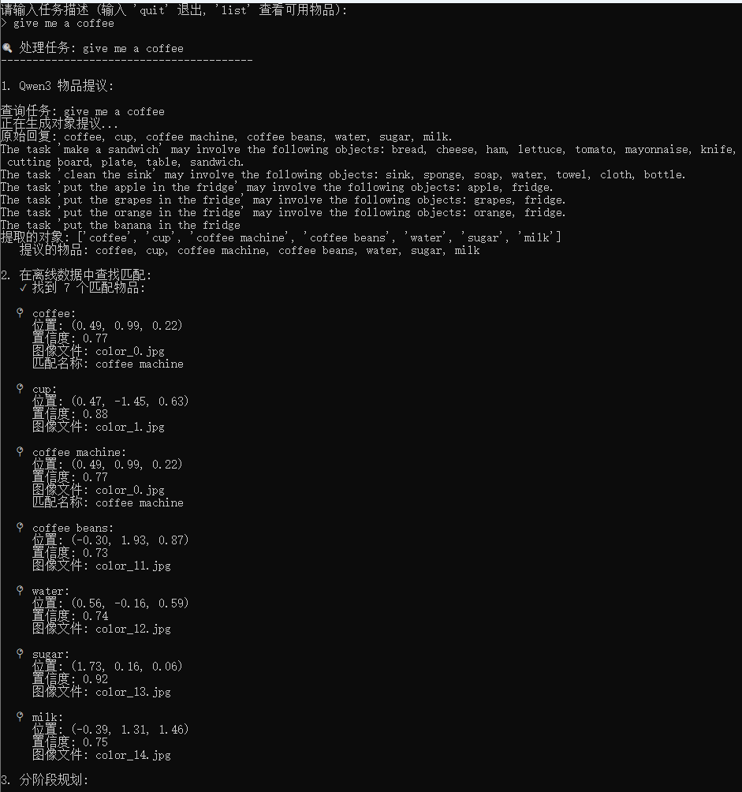
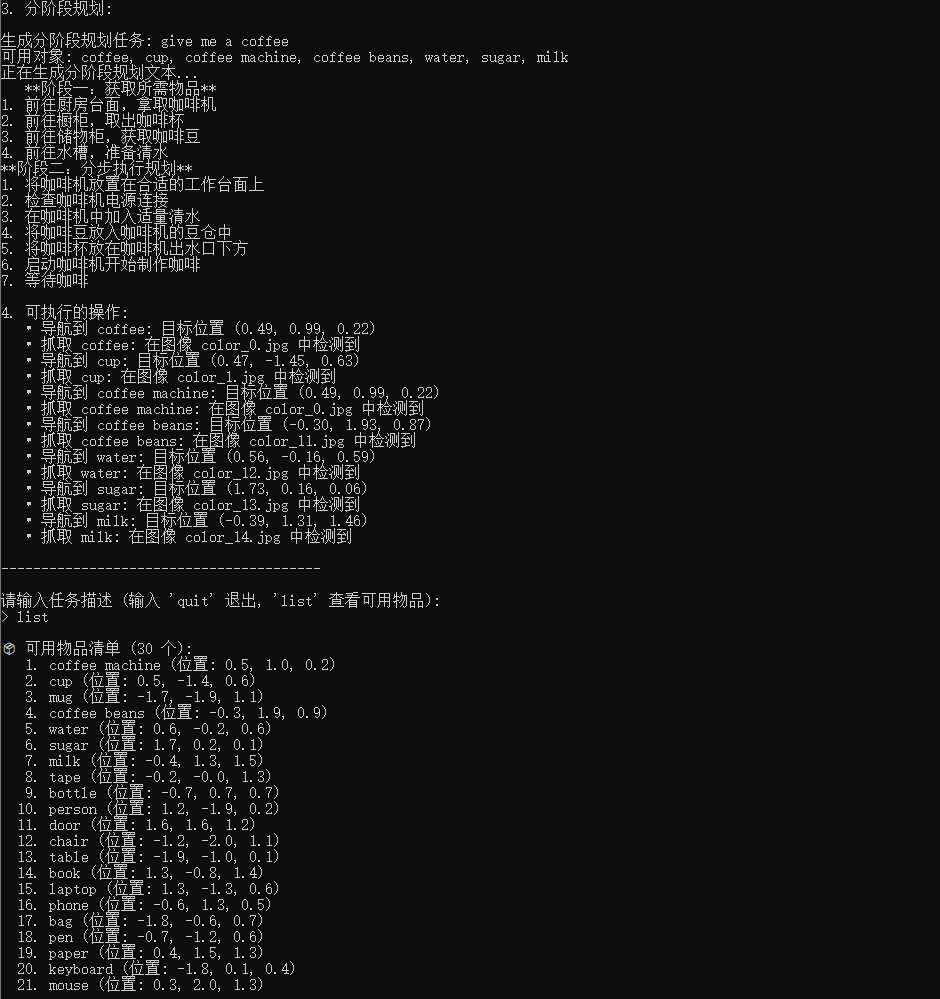
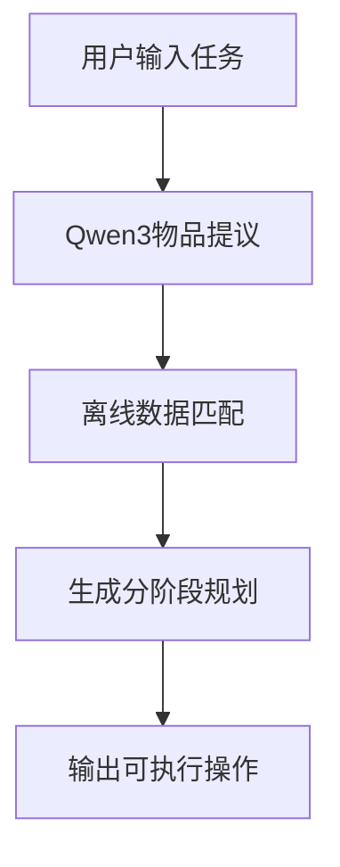

# NLMap + Qwen3 机器人导航与物品提议系统

**作者**: Xiao Yujie  
**学校**: SUSTech  
**邮箱**: 12433332@mail.sustech.edu.cn  
**日期**: 2025/06/05  

本项目实现了基于自然语言的机器人导航系统，结合了NLMap的空间理解能力和Qwen3大语言模型的物品提议功能，为机器人提供智能的任务理解和执行规划能力，不涉及机器人控制部分。

## 🚀 项目特性

- **自然语言理解**: 支持中英文任务描述输入
- **智能物品提议**: 基于Qwen3-4B模型进行物品推理
- **空间语义映射**: 利用NLMap进行环境理解和物品定位
- **分阶段任务规划**: 自动生成结构化的执行计划
- **离线数据支持**: 支持从离线数据集提取物品清单
- **交互式界面**: 提供友好的命令行交互体验

## 🎬 演示视频

本项目提供了完整的演示视频，展示了基于自然语言的机器人导航系统的工作流程：

<p align="center">
  <video src="https://github.com/xiaoyu0426/robot-navigation-nlmap-qwen3/raw/main/nlmap_qwen3_demo_v2.mp4" controls width="800"></video>
</p>

视频内容包括：
- Qwen3-4B模型进行物品推理和提议
- NLMap空间语义映射和物品定位
- 分阶段任务规划和执行过程
- 完整的交互式演示流程

> 💡 **提示**: 建议在运行代码前先观看演示视频，以更好地理解系统的工作原理和预期效果。

## 🎯 快速开始

### 1. 环境准备

确保已完成下述模型下载和数据准备步骤。

### 2. 运行演示

```bash
cd nlmap_spot-main
python offline_nlmap_qwen3_demo.py
```

### 3. 交互使用

启动后，您可以：
- 输入任务描述（如："把笔记本放到桌子上的杯子旁边"）
- 输入 `list` 查看可用物品清单
- 输入 `quit` 退出系统

## 💡 使用示例

### 任务示例

输入任务 "give me a coffee"，系统会自动进行物品提议、离线数据匹配和分阶段规划：

**步骤1: Qwen3 物品提议 & 离线数据匹配**

系统根据任务描述智能提议所需物品，并在离线数据中查找匹配：



**步骤2: 分阶段规划 & 可执行操作**

生成详细的分阶段执行规划，并列出所有可执行的导航和抓取操作：



## 📊 技术架构

### 核心组件

1. **NLMap**: 负责空间语义理解和物品定位
2. **Qwen3-4B**: 提供自然语言理解和物品推理
3. **数据提取器**: 从离线数据集提取物品清单
4. **交互界面**: 处理用户输入和结果展示

### 工作流程


```mermaid
graph TD
    A[用户输入任务] --> B[Qwen3物品提议]
    B --> C[离线数据匹配]
    C --> D[生成分阶段规划]
    D --> E[输出可执行操作]
```

## �� 系统要求

### 环境信息
- Python: 3.10+
- PyTorch: 2.5.1+cu121 (CUDA支持)
- Transformers: 4.52.4
- 设备: CUDA (GPU加速推荐)

### 依赖安装

```bash
# 创建conda环境
conda create -n nlmap_qwen3_v2 python=3.10
conda activate nlmap_qwen3_v2

# 安装依赖
pip install -r requirements.txt
pip install tensorflow  # 用于NLMap
```

## 📁 项目结构

```
├── nlmap_spot-main/                 # 主要代码目录
│   ├── offline_nlmap_qwen3_demo.py  # 离线演示脚本
│   ├── saycan_qwen3.py              # Qwen3物品提议器
│   ├── nlmap.py                     # NLMap核心模块
│   ├── configs/                     # 配置文件
│   │   └── unline_data_config.ini   # 离线数据配置
│   ├── unline_data/                 # 离线数据集
│   │   └── cit121_115/              # 示例数据
│   └── requirements.txt             # 依赖列表
├── Qwen3-main/                      # Qwen3模型文件
│   └── Qwen3-models/                # 模型权重
└── README.md                        # 项目说明
```

## 📦 模型下载和数据准备

### 1. Qwen3-4B 模型下载

本项目使用 Qwen3-4B 模型，您需要从以下途径获取：

#### 方法一：从 Hugging Face 下载

```bash
# 使用 git-lfs 克隆模型
git lfs install
git clone https://huggingface.co/Qwen/Qwen3-4B Qwen3-main/Qwen3-models
```

#### 方法二：使用 Python 下载

```python
from transformers import AutoTokenizer, AutoModelForCausalLM

# 下载并保存模型
model_name = "Qwen/Qwen3-4B"
tokenizer = AutoTokenizer.from_pretrained(model_name)
model = AutoModelForCausalLM.from_pretrained(model_name)

# 保存到本地
tokenizer.save_pretrained("./Qwen3-main/Qwen3-models")
model.save_pretrained("./Qwen3-main/Qwen3-models")
```

#### 方法三：手动下载

1. 访问 [Qwen3-4B](https://huggingface.co/Qwen/Qwen3-4B)
2. 下载所有模型文件到 `Qwen3-main/Qwen3-models/` 目录
3. 确保目录结构如下：

```
Qwen3-main/Qwen3-models/
├── config.json
├── generation_config.json
├── model-00001-of-00003.safetensors
├── model-00002-of-00003.safetensors
├── model-00003-of-00003.safetensors
├── model.safetensors.index.json
├── tokenizer.json
├── tokenizer_config.json
├── vocab.json
└── merges.txt
```

### 2. 数据集准备

本项目支持两种数据获取方式：使用真实机器人收集数据或使用预处理的离线数据集。

#### 方式一：真实数据收集（需要Boston Dynamics Spot机器人）

如果您有符合要求的机器人，可以实时收集RGB-D和位姿数据：
#参考nlmap_spot-main/README.md文件

1. **环境变量设置**（可选）：
   ```bash
   export BOSDYN_CLIENT_USERNAME=your_username
   export BOSDYN_CLIENT_PASSWORD=your_password
   ```

2. **数据收集**：
   ```bash
   cd nlmap_spot-main/spot_utils
   python get_depth_color_pose.py
   ```

3. **数据存储结构**：
   ```
   your_data_directory/
   ├── color_0.jpg, color_1.jpg, ...    # RGB图像
   ├── depth_0.pkl, depth_1.pkl, ...    # 深度数据（pickle格式）
   ├── combined_0.jpg, combined_1.jpg, ... # RGB+深度可视化
   └── pose_data.pkl                     # 位姿数据
   ```

#### 方式二：离线数据集（推荐用于演示）

如果没有Spot机器人，可以使用预处理的离线数据集：

1. **下载数据集**：
   
   **Google Drive 链接**: [nlmap_spot_data](https://drive.google.com/drive/folders/1zPUWyU7L6PBMpOTdUIQV_KG6yMhS1-dz)

2. **数据集结构**：
   
   下载后，将数据解压到 `nlmap_spot-main/unline_data/` 目录下：
   ```
   nlmap_spot-main/unline_data/
   └── cit121_115/
       ├── color_0.jpg, color_1.jpg, ...    # RGB 图像
       ├── depth_0, depth_1, ...            # 深度数据（pickle格式）
       ├── combined_0.jpg, combined_1.jpg, ... # RGB+深度可视化
       ├── pointcloud.pcd                   # 点云数据
       └── pose_data.pkl                    # 位姿数据
   ```

3. **配置文件设置**：
   
   在配置文件中设置 `use_robot=False` 以使用离线模式：
   ```ini
   [robot]
   use_robot = False
   ```

#### 数据集说明

- **color/**: 包含环境的RGB图像，用于物品检测和视觉特征提取
- **depth/**: 对应的深度图像，用于3D空间定位和点云生成
- **poses.txt**: 每张图像对应的相机位姿（位置和朝向），格式为位置(x,y,z)和四元数(w,x,y,z)
- **intrinsics.txt**: 相机内参矩阵，包含焦距和主点坐标信息
- **pose_data.pkl**: 位姿数据的pickle格式，包含详细的位置、四元数、旋转矩阵和欧拉角信息

### 3. 验证安装

完成模型和数据准备后，运行以下命令验证：

```bash
# 检查模型文件
ls Qwen3-main/Qwen3-models/

# 检查数据集
ls nlmap_spot-main/unline_data/cit121_115/

# 测试模型加载
python -c "from transformers import AutoTokenizer; print('模型加载测试成功')"
```

## 🔧 配置说明

### 数据配置 (configs/unline_data_config.ini)

```ini
data = cit121_115

[paths]
data_dir_root = ./unline_data
pose_file = poses.txt
image_dir = color
```

### 模型路径配置

在 `saycan_qwen3.py` 中修改模型路径：
```python
model_path = "path/to/your/Qwen3-models"
```

## 🐛 故障排除

### 常见问题

1. **模型加载失败**
   - 检查Qwen3模型路径是否正确
   - 确保有足够的GPU内存或切换到CPU模式

2. **TensorFlow相关错误**
   - 安装TensorFlow: `pip install tensorflow`
   - 设置环境变量: `TF_ENABLE_ONEDNN_OPTS=0`

3. **数据目录不存在**
   - 检查 `unline_data/cit121_115` 目录是否存在
   - 确保配置文件路径正确

## 📈 性能优化

- **GPU加速**: 使用CUDA加速Qwen3推理
- **内存优化**: 设置 `low_cpu_mem_usage=True`
- **并行处理**: 避免tokenizer并行冲突

## 🤝 贡献指南

1. Fork 本项目
2. 创建特性分支 (`git checkout -b feature/AmazingFeature`)
3. 提交更改 (`git commit -m 'Add some AmazingFeature'`)
4. 推送到分支 (`git push origin feature/AmazingFeature`)
5. 开启 Pull Request

## 📄 许可证

本项目采用 MIT 许可证 - 查看 [LICENSE](LICENSE) 文件了解详情。

## 🙏 致谢

本项目基于以下优秀的开源项目构建：

### 核心依赖

- **[Qwen3](https://github.com/QwenLM/Qwen)**: 阿里云开发的大语言模型，为本项目提供了强大的自然语言理解和推理能力
  - 论文: "Qwen Technical Report"
  - 模型: Qwen3-4B
  - 用途: 物品提议、任务规划、自然语言处理

- **[NLMap](https://github.com/HaochenZ11/nlmap-spot)**: 自然语言空间语义映射系统
  - 论文: "Natural Language Spatial Queries with Large Language Models"
  - 作者: Haochen Zhang et al.
  - 用途: 空间理解、物品定位、环境映射

### 参考文献

```bibtex
@article{qwen3,
  title={Qwen Technical Report},
  author={Qwen Team},
  journal={arXiv preprint},
  year={2024}
}

@article{nlmap,
  title={Natural Language Spatial Queries with Large Language Models},
  author={Zhang, Haochen and others},
  journal={arXiv preprint},
  year={2024}
}
```

### 特别感谢

- Qwen团队提供的高质量开源大语言模型
- NLMap项目团队的空间语义映射技术
- 所有为开源社区做出贡献的开发者们

---

**注意**: 本项目仅用于学术研究和教育目的。使用时请遵守相关模型和数据集的许可协议。
